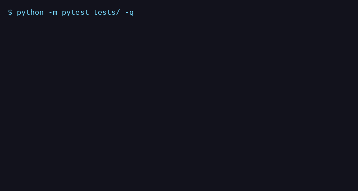

# n8n workflow automation




Most automations work fine until 2am on a Tuesday, when an API hiccups and your lead data silently vanishes. This repo shows the three importable n8n workflows we use to prevent that — every step retries, every failure lands somewhere visible, and nothing is ever dropped quietly.

Built by [Vroom Analytics](https://vroomanalytics.com/automation/) as public proof for our **AI automation & orchestration service**.

---

## What's inside

Three realistic n8n workflows, plus the Python that proves they hold up:

| File | What it does | The 2am story |
|---|---|---|
| `workflows/lead-intake-pipeline.json` | Webhook → qualify → CRM write → confirmation | CRM write retries 3×, then dead-letters the lead and alerts a human |
| `workflows/nightly-crm-sync.json` | Midnight schedule → sync records in batches | One bad record can't kill the sync; it parks the record and keeps going |
| `workflows/dead-letter-reprocessor.json` | Every 15 min → retry parked items | Reprocesses failures; poison messages get quarantined and paged, never retried forever |
| `src/n8n_reliability/validator.py` | The reliability checklist as code | 4 checks every workflow must pass (below) |
| `src/n8n_reliability/retry.py` | Exponential-backoff retry policy | The Python mirror of n8n's `retryOnFail` |
| `src/n8n_reliability/dlq.py` | File-backed dead-letter queue | Park → requeue → done / quarantined, persisted as JSON |

Every workflow passes the same four checks, enforced by `validator.py`:

1. **Valid n8n shape** — nodes with id/name/type/parameters/position, connections that reference real nodes.
2. **Error handling** — an `errorWorkflow`, an Error Trigger node, or `onError` routing. The n8n default (stop the workflow, lose the data) is not acceptable.
3. **Retry config** — every node that touches an external system sets `retryOnFail` with explicit `maxTries >= 2` and `waitBetweenTries`. Explicit, not defaulted: retry settings you can't see are settings you can't audit.
4. **A failure path** — failures route to something wired: a dead-letter, alert, or quarantine node. An unwired node with "dead letter" in its name is decoration, not a failure path.

## 5-minute setup

All steps below were run verbatim on a clean machine — they work as written.

1. **Get the code and enter the folder:**
   ```bash
   cd n8n-ai-workflow-automation
   ```

2. **Create a virtual environment and install the one dependency:**
   ```bash
   python3 -m venv .venv
   source .venv/bin/activate
   pip install -r requirements.txt
   ```

3. **Run the reliability gate over all three workflows:**
   ```bash
   python - <<'EOF'
   import sys
   sys.path.insert(0, "src")
   from n8n_reliability import validate_workflow_file
   for f in ["lead-intake-pipeline", "nightly-crm-sync", "dead-letter-reprocessor"]:
       r = validate_workflow_file(f"workflows/{f}.json")
       print(f"{r.name}: {'RELIABLE' if r.is_reliable else 'FAILED'}")
   EOF
   ```
   Expected: all three print `RELIABLE`.

4. **Import one into n8n:** in n8n, go to **Workflows → ⋯ → Import from File** and pick e.g. `workflows/lead-intake-pipeline.json`. Replace the `https://crm.example.com` URLs and the `#leads` / `#ops` Slack channels with your own, add your credentials to the HTTP/Slack/Email nodes, and activate.

## Running the tests

```bash
pip install -r requirements.txt && pytest -q
```

Expected: `88 passed`. The suite covers the failure modes this repo exists to prevent:

- A workflow with **no error handling** does not validate
- A workflow with **no retry config** on a network node does not validate
- A workflow with **no failure path** does not validate (including the sneaky case: a dead-letter node nobody routes to)
- **Poison messages** are quarantined after the requeue limit — never retried forever, never silently re-queued
- **Retry backoff** follows the exponential schedule; permanent errors raise immediately instead of burning retries
- **Dead-lettered items survive restarts** (the queue is file-backed)

Plus: schema validation of every node/connection, FIFO reprocessing order, and audit records for everything the queue touches. No network calls in tests — everything is fixture-backed.

## How this maps to the offer

This is the engineering behind our **AI automation & orchestration** service (S01): the Basic package's "error handling, failure alerts," the Standard package's "monitoring view + alert routing," and the Premium package's "30-day monitoring." Buyers don't pay for the workflow — they pay for never having to think about it at 2am. These workflows and the validator are the proof we actually build that way.

**The Vroom page:** [AI automation & orchestration — vroomanalytics.com/automation](https://vroomanalytics.com/automation/)

## Monthly peace of mind

Setup is just day one. The [$99/mo care plan](https://vroomanalytics.com/automation/) keeps this running — monitoring, fixes, and monthly optimization, so you never think about it again.

## License

MIT — see [LICENSE](LICENSE). Steal the dead-letter pattern; it's the cheapest insurance in automation.
